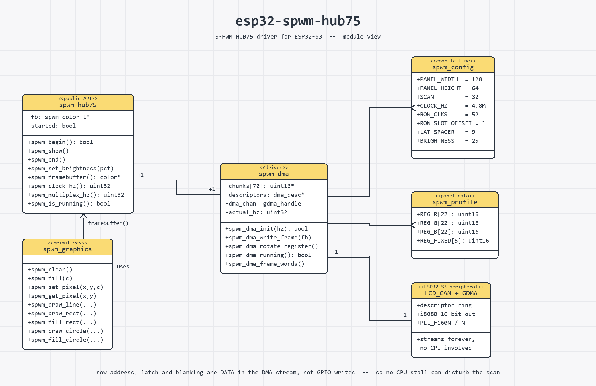

# esp32-spwm-hub75

ESP32-S3 driver for **S-PWM HUB75 LED panels** -- the kind whose column driver
(ICND1065L and similar) does its own PWM.

## Why this exists

An S-PWM panel takes **one 16-bit greyscale word per pixel per colour, once per
frame**. Ordinary HUB75 panels want binary code modulation: 8–11 weighted
bitplane passes per frame. That is what every existing ESP32 HUB75 library
implements, so none of them can drive an S-PWM panel -- it is a different wire
protocol, not a configuration difference.

It is also *cheaper*: one pass at 16 bits beats 8–11 weighted passes. Throughput
was never the difficulty. The init sequence was.

## How it works

The entire waveform lives in a DMA buffer. Pixel data, row address, latch and
blanking are all bits in a 16-bit word clocked out by **LCD_CAM through GDMA**
from a descriptor ring that loops forever. The CPU only patches pixel bits.

Nothing the cores do -- WiFi, a stalled task, a flash cache miss -- can disturb the
scan. The same panel on a Raspberry Pi needed core isolation and realtime
priority and still showed artefacts; those turned out to be timing jitter, and
they do not occur here.

## Architecture



Sequence and data-flow diagrams: [docs/ARCHITECTURE.md](docs/ARCHITECTURE.md).
Regenerate the image with `python tools/uml_diagram.py`.

## Quick start

```cpp
#include <spwm_hub75.h>

void setup() {
  if (!spwm_begin()) { /* not enough internal DMA-capable RAM */ }
  spwm_set_brightness(25);          // full drive is ~1.2 A and harsh
}

void loop() {
  spwm_clear();
  spwm_draw_line(0, 0, spwm_width() - 1, spwm_height() - 1, spwm_rgb(255, 0, 0));
  spwm_fill_circle(64, 32, 10, spwm_rgb(0, 0, 255));
  spwm_show();                      // the only call that touches the panel
}
```

## API

Everything is prefixed `spwm_`. Colours are `0x00RRGGBB`; build them with
`spwm_rgb(r, g, b)`.

### Lifecycle

| Call | Returns | Notes |
|---|---|---|
| `spwm_begin()` | `bool` | Allocates, configures the peripheral, starts the transfer. Always check it. |
| `spwm_show()` | | Pushes the framebuffer. The only call that touches the panel. |
| `spwm_end()` | | Releases the framebuffer. |
| `spwm_set_brightness(pct)` | | 0..100 percent of full drive. Takes effect on the next `spwm_show()`. |
| `spwm_get_brightness()` | `uint8_t` | |

### Drawing

All primitives are clipped, so any coordinates are safe. Nothing reaches the
panel until `spwm_show()`.

| Call | Notes |
|---|---|
| `spwm_clear()` | Fills with black. |
| `spwm_fill(c)` | Fills with a colour. |
| `spwm_set_pixel(x, y, c)` | |
| `spwm_get_pixel(x, y)` | Returns `spwm_color_t`; 0 if out of bounds. |
| `spwm_draw_hline(x, y, w, c)` | Negative `w` draws leftward. |
| `spwm_draw_vline(x, y, h, c)` | Negative `h` draws upward. |
| `spwm_draw_line(x0, y0, x1, y1, c)` | Bresenham. |
| `spwm_draw_rect(x, y, w, h, c)` | Outline. |
| `spwm_fill_rect(x, y, w, h, c)` | Clipped once rather than per pixel. |
| `spwm_draw_circle(cx, cy, r, c)` | Midpoint circle. |
| `spwm_fill_circle(cx, cy, r, c)` | Span filled, so no seams. |

### Text

| Call | Notes |
|---|---|
| `spwm_draw_text(x, y, str, c)` | Returns width drawn. `
` starts a new line. |
| `spwm_draw_char(x, y, ch, c)` | Returns the advance. |
| `spwm_text_width(str)` | Width in pixels, without drawing. |
| `spwm_font_height()` | Line height of the current font. |
| `spwm_set_font(f)` | Adafruit GFX font, or `NULL` for the built-in. |

A 6x8 font is built in: 21 characters across a 128 px panel, 8 lines down a
64 px one, 760 bytes of flash. It is generated from DejaVu Sans Mono by
`tools/make_font.py`, so the data is reproducible rather than an unexplained
wall of hex.

For larger type, point `spwm_set_font()` at any Adafruit GFX font. The structs
are layout-compatible with `GFXfont`/`GFXglyph`, so the hundreds of existing
`Fonts/*.h` headers work by casting, with **no dependency on Adafruit_GFX**:

```cpp
#include <Fonts/FreeSans9pt7b.h>
spwm_set_font((const spwm_gfx_font_t *) &FreeSans9pt7b);
spwm_draw_text(2, 20, "Hello", spwm_rgb(255, 255, 255));
spwm_set_font(NULL);                 // back to the built-in
```

`y` is the **top of the cell** for the built-in font and the **baseline** for a
GFX font, which is each format's own convention. Mixing them up puts text one
font height out of place.

### Orientation

| Call | Notes |
|---|---|
| `spwm_set_rotation(deg)` | 0, 90, 180 or 270, clockwise as the viewer sees it. |
| `spwm_set_mirror(x, y)` | Mirror the logical axes, applied before rotation. |

Rotation applies to every drawing call including text, and `spwm_width()` /
`spwm_height()` swap under 90 and 270, so use those rather than
`SPWM_PANEL_WIDTH`/`HEIGHT` in drawing code.

**Rotation alone cannot describe every mounting.** If a panel's column order
runs opposite to the assumed direction the result is a *reflection*, and no
rotation is a reflection. The symptom is mirrored text on otherwise perfect
output, which is invisible in gradients, ramps and other symmetric content, so
it survives casual testing. Determine it with an asymmetric mark: draw a letter
`F` and a block at the origin, and see where they land.

The panel this was developed on, stood on its end, needs:

```cpp
spwm_set_rotation(90);
spwm_set_mirror(true, false);
```

`spwm_framebuffer()` is **not** rotated. It is the raw panel buffer by
definition.

### Framebuffer and geometry

| Call | Returns | Notes |
|---|---|---|
| `spwm_framebuffer()` | `spwm_color_t*` | Direct access. Row-major, `width * height`, `0x00RRGGBB`. No bitplane layout to respect: the panel takes greyscale words. |
| `spwm_width()` | `int` | |
| `spwm_height()` | `int` | |

### Diagnostics

| Call | Returns | Notes |
|---|---|---|
| `spwm_clock_hz()` | `uint32_t` | Achieved clock. Only 160 MHz / integer N is available, so it rarely equals the request. |
| `spwm_multiplex_hz()` | `uint32_t` | Row refresh rate. This is what governs visible flicker. |
| `spwm_frame_words()` | `uint32_t` | Words per DMA frame, i.e. buffer bytes / 2. |
| `spwm_is_running()` | `bool` | GDMA channel state. |

## Wiring

Any GPIOs will do: the LCD peripheral reaches them through the GPIO matrix, so
converting an existing bit-banged wiring needs no rewiring. Defaults are in
`spwm_config.h`; override with `-D` build flags.

**No level shifting needed.** 3.3 V straight into the panel's 74HC245 works, and
adding proper 5 V buffering was measured to change nothing.

Avoid on ESP32-S3: 0/3/45/46 (strapping), 19/20 (native USB), 35/36/37 (octal
PSRAM on N8R8/N16R8), 43/44 (UART0), 48 (onboard LED).

## Configuration

All of `spwm_config.h` is `#ifndef`-guarded. The ones that matter:

| Flag | Default | Notes |
|---|---|---|
| `SPWM_PANEL_WIDTH` / `_HEIGHT` | 128 / 64 | |
| `SPWM_SCAN` | 32 | 1/32 scan |
| `SPWM_CLOCK_HZ` | 4800000 | see below |
| `SPWM_BRIGHTNESS` | 25 | percent of full drive |
| `SPWM_ROW_SLOT_OFFSET` | 1 | see below |
| `SPWM_LAT_SPACER` | 9 | profile default |

Configuration is compile-time because the DMA frame layout derives from it -- buffer size, descriptor count and every control-bit position.

### Clock rate

`SPWM_CLOCK_HZ` sets the multiplex rate: `clock / SPWM_ROW_CLKS / SPWM_SCAN`.
Only 160 MHz / integer N is achievable, so the achieved clock rarely equals the
request; `spwm_clock_hz()` reports what you got.

The default 4.8 MHz gives 2913 Hz multiplex at 68 fps. **6.4 MHz gives the
panel's rated 3846 Hz and does work** -- but on dupont wiring the shift chain is
marginal there: the chip whose bits land first after each latch tears and drops
colour bits on fine detail. That is a signal-integrity limit, not a panel limit.
Shorter leads or a ground return beside CLK should buy the rated rate back.

Do **not** widen `SPWM_LAT_SPACER` to compensate. It papers over the symptom
non-monotonically (9 bad, 18 better, 32 nearly clean, 48 *worse*) and no model
explains that. Lower the clock instead.

### Row slot offset

**The panel writes upload iteration `i` into row slot `(i + SPWM_ROW_SLOT_OFFSET)`.**
Measured as 1 on the panel this was developed against.

Without it the whole image sits one physical row high and the wrap row is
starved of data, which looks like a dim line at the half boundary -- and is very
easy to mistake for a brightness fault. If your panel shows a single anomalous
row, test this with **sparse, individually identifiable marks**: a few lit pixels
on known rows at *different column offsets*. A ramp, a gradient or full-width
lines cannot see a uniform shift; they show only the starved row, as brightness.

## Memory

The DMA frame is ~140 KB and **must** be in internal DMA-capable RAM. It cannot
be one contiguous block -- that allocation fails once WiFi is up, with plenty of
internal RAM free but fragmented -- so each descriptor owns a 2 KB chunk.

The framebuffer goes to PSRAM when available, falling back to internal. Check
`heap_caps_get_largest_free_block(MALLOC_CAP_INTERNAL)` before adding tasks:
largest-block matters more than free total.

**Nothing may touch the panel pins after `spwm_begin()`.** It routes them to
LCD_CAM through the GPIO matrix, and a later `pinMode()` on any of them
disconnects the peripheral. The failure is deceptive: the DMA keeps streaming
and every diagnostic reports healthy while the panel is dark. Converting from a
bit-banged driver means deleting its pin setup, not just its refresh loop.

**A static image stays lit.** The panel's slot-3 register rotates through 22
words and has to keep cycling or the panel loses its configuration. The driver
maintains that on its own timer, so drawing once and never calling `spwm_show()`
again is fine. This was not always true, and the failure gave no clue: the DMA
reported healthy while the panel went dark.

**Always check `spwm_begin()`.** A failed init leaves nothing driving the panel,
and a null framebuffer is a fast route to a crash loop.

**A correct picture is not evidence the firmware is healthy.** Under DMA the
image persists with no CPU involvement, so a wedged application still looks
perfect. `spwm_is_running()` reports the GDMA channel state.

## Panel profile

`spwm_profile.h` carries the `icnd1065l_regtype91` register profile
("P2.5 - ICND1065L - 6158 - 1/32"). A different panel needs a different profile;
the upstream fork ships 428 of them.

Three things about the init sequence are not obvious and each causes total
failure if missed:

1. **Register payloads repeat once per cascaded chip** (width / channels).
   Send each word once and at most one chip is configured -- the panel stays
   dark and draws ~5 mA instead of ~20 mA.
2. **The init script runs at the start of every frame**, not once at boot.
3. **The RGB slot is a rotating register** -- one word per frame, cycling through
   the profile. Sending all of them once configures almost nothing.

Driver current is the best bring-up signal: ~5 mA uninitialised vs ~20 mA
configured, regardless of what is displayed. It separates init problems from data
problems instantly.

## Licence and attribution

**GPL-2.0-or-later.** See `LICENSE`.

The register payloads in `spwm_profile.h` come from
[kingdo9/rpi-rgb-led-matrix_pwm_experiment](https://github.com/kingdo9/rpi-rgb-led-matrix_pwm_experiment),
a GPL-2.0 S-PWM fork of hzeller's `rpi-rgb-led-matrix`. That is why this library
is GPL -- read that project first if you are porting to another panel; its
`lib/spwm/spwm-helpers.cc` is the authoritative description of the protocol.

The LCD_CAM and GDMA register setup follows
[esphome-libs/esp-hub75](https://github.com/esphome-libs/esp-hub75) (MIT,
Copyright (c) 2025 Stuart Parmenter). Its buffer *contents* are not reusable
here -- that library is binary code modulation throughout -- but its peripheral
layer is worth reading rather than deriving from the TRM.
