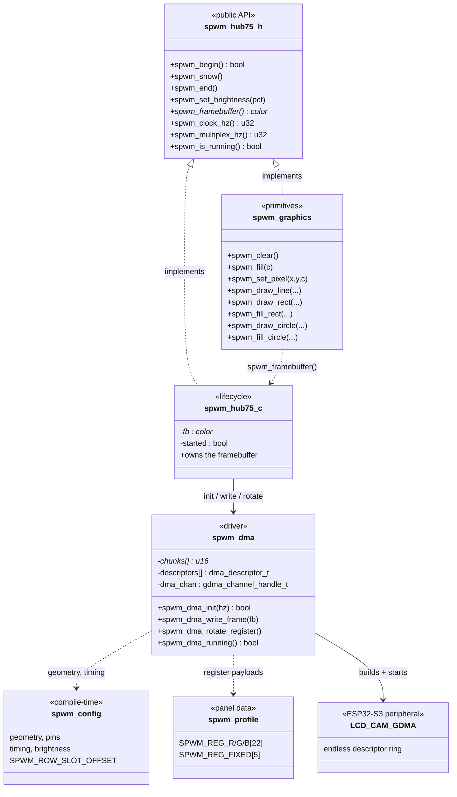
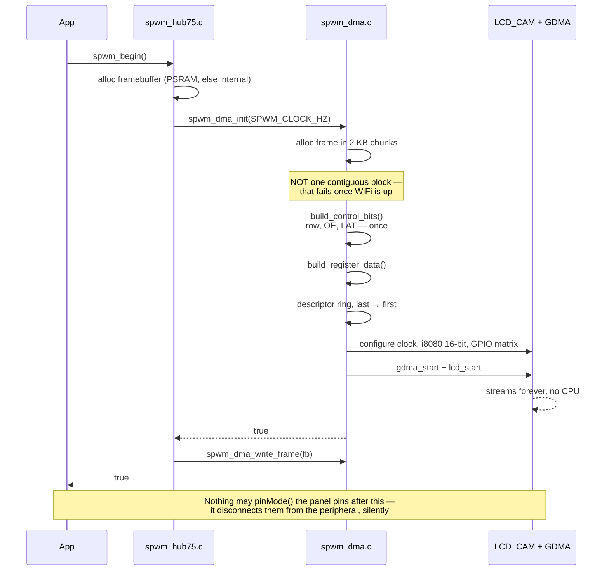
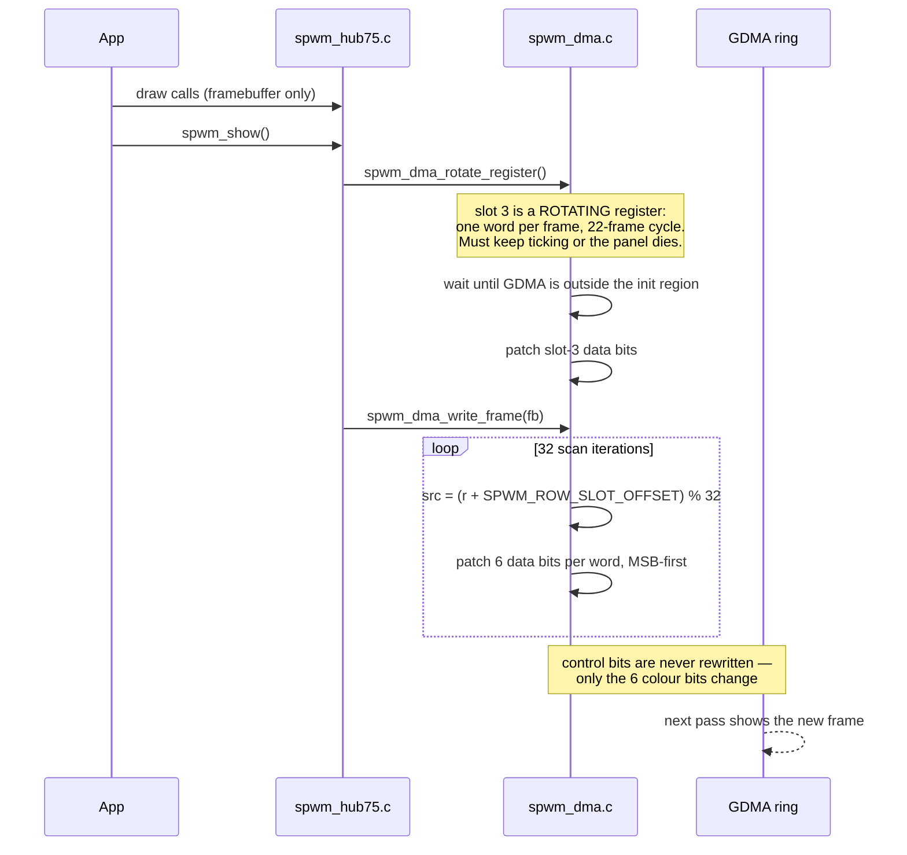
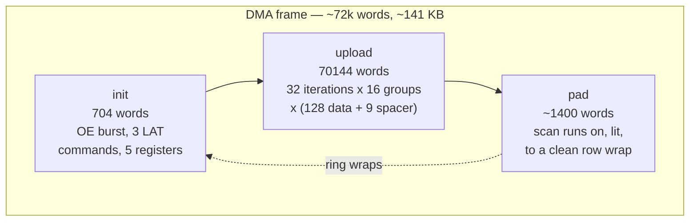
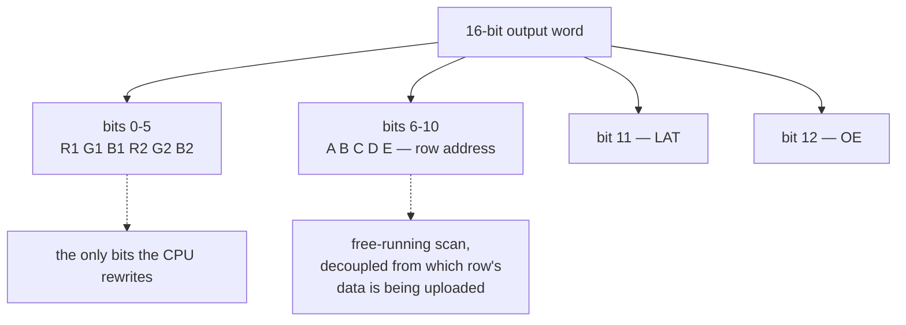

# Architecture

Diagrams render on GitHub and in most Markdown viewers.

The library is C, not object-oriented, so these are UML *component* and
*sequence* views rather than class hierarchies — modules with their public
operations, and the call flow between them.

## Modules

`spwm_config.h` and `spwm_profile.h` are compile-time inputs, not runtime
objects: the DMA frame layout — buffer size, descriptor count, every
control-bit position — is computed from them.

## Startup

## Per frame

## Frame layout

One 16-bit word per clock. Every signal except CLK is a bit in that word, so
the DMA stream carries the complete waveform.

## Why the CPU cannot disturb the picture

The row address, latch and blanking are *data*, not GPIO writes. Once the
descriptor ring is running, the scan is generated by the peripheral. A stalled
task, WiFi activity or a flash cache miss cannot affect it.

The corollary is a trap worth stating: **a correct picture is not evidence the
firmware is healthy.** The image persists with no CPU involvement at all, so a
wedged application still looks perfect. `spwm_is_running()` reports the GDMA
channel state — but even that is true of a board whose application task has died.
